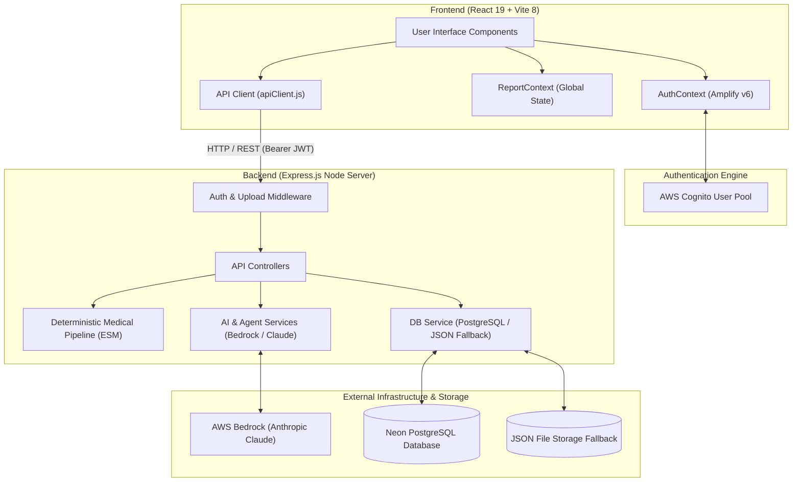
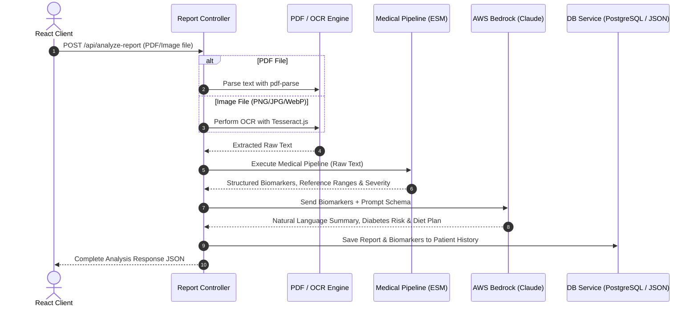

# NutriHealth (NutriCare) Architecture Documentation

Welcome to the architectural documentation for **NutriHealth (NutriCare)** — an AI-powered blood report and medical biomarker analysis platform.

This document details the system design, components, workflows, and data pipelines, split into two primary sections: **Frontend Architecture** and **Backend Architecture**.

---

## 📐 System Architecture Overview



---

## 🎨 Part 1: Frontend Architecture

The frontend is a single-page application (SPA) built using **React 19**, bundled with **Vite 8**, and styled with **Tailwind CSS v4** and **Framer Motion**.

### 1. Key Technologies & Dependencies

- **React 19**: Modern UI rendering engine utilizing hooks and concurrent features.
- **Vite 8**: Lightning-fast build tool and development server with Hot Module Replacement (HMR).
- **Tailwind CSS v4**: Utility-first CSS engine for responsive design.
- **Framer Motion**: Production-grade animation library for smooth UI transitions and loading states.
- **Lucide React**: Icon library for iconography across the UI.
- **React Router v7**: Declarative client-side routing and navigation.
- **AWS Amplify v6**: Official client library for AWS Cognito user authentication.

---

### 2. Frontend Directory Structure

```
NutriHealth-main/
├── vite.config.js              # Vite configuration & dev server proxy (/api -> http://localhost:5000)
├── index.html                  # HTML entry point
├── src/
│   ├── main.jsx                # Application root, AWS Amplify initialization
│   ├── App.jsx                 # Route definitions & global layout wrappers
│   ├── Layout.jsx              # Main dashboard shell (Sidebar, Header, User Menu)
│   ├── Dashboard.jsx           # File upload interface (PDF/Image dropzone)
│   ├── Processing.jsx          # Real-time multi-step analysis progress tracker
│   ├── Results.jsx             # Biomarker analysis summary & recommendations dashboard
│   ├── Assistant.jsx           # Interactive AI health assistant chat interface
│   ├── Account.jsx             # User profile, health goals, & preference settings
│   ├── HealthTips.jsx          # Educational wellness and health recommendations
│   ├── Login.jsx               # User sign-in view
│   ├── Signup.jsx              # User registration view
│   ├── VerifyEmail.jsx         # Email verification code view
│   ├── ForgotPassword.jsx      # Password recovery initiate view
│   ├── ResetPassword.jsx       # Password reset confirmation view
│   ├── api/
│   │   └── apiClient.js        # Centralized HTTP client with automatic Cognito JWT auth token injection
│   ├── context/
│   │   ├── AuthContext.jsx     # Context provider for user session & authentication state
│   │   └── ReportContext.jsx   # Context provider for active report data & chat transcript
│   ├── components/
│   │   ├── account/            # Tabbed account management sub-components
│   │   └── consultation/       # Medical report view components (BiomarkersGrid, MealPlanCard, PDFExport, etc.)
│   └── services/
│       └── authService.ts      # AWS Amplify Auth SDK wrapper
```

---

### 3. Authentication & State Management Architecture

#### **A. AuthContext (`AuthContext.jsx`)**
- Manages authentication state using **AWS Amplify Auth SDK** (`aws-amplify/auth`).
- Persists user sessions via AWS Cognito.
- Exposes user attributes (`user`, `tokens`, `isAuthenticated`, `loading`).
- Provides handlers for `signIn`, `signUp`, `confirmSignUp`, `signOut`, `forgotPassword`, and `confirmResetPassword`.

#### **B. ReportContext (`ReportContext.jsx`)**
- Holds state for the actively uploaded medical report, raw OCR text, analyzed biomarkers, personalized diet plans, and disease risks.
- Maintains chat message history for the AI Assistant view (`Assistant.jsx`).
- Syncs report state between the `Dashboard`, `Processing`, `Results`, and `Assistant` views.

---

### 4. Client API Layer (`apiClient.js`)

All communication between the React frontend and Express backend flows through `apiClient.js`.

- **Base URL Routing**: Automatically resolves backend host based on environmental configuration.
- **JWT Injection**: Intercepts requests and injects `Authorization: Bearer <Cognito-IdToken>` into headers via Amplify `fetchAuthSession()`.
- **Endpoints Handled**:
  - `POST /api/analyze-report`: Submits file payloads (`multipart/form-data`) for analysis.
  - `POST /api/chat`: Sends user queries along with active report context to the AI assistant.
  - `GET/PUT /api/profile`, `/api/health-goals`, `/api/preferences`: Handles user profile synchronization.

---

### 5. Frontend View & Workflows

1. **Upload & Ingestion (`Dashboard.jsx`)**: Drag-and-drop file uploader supporting PDF and Image formats (PNG, JPG, WebP) up to 15 MB.
2. **Analysis Progress (`Processing.jsx`)**: Animated step indicator showing OCR processing, biomarker extraction, reference range matching, and Bedrock AI summary generation.
3. **Analysis Dashboard (`Results.jsx`)**:
   - **Biomarker Grid**: Grouped view of 15 lab categories (CBC, Lipid, Metabolic, etc.) with color-coded status badges (Normal, High, Low, Critical).
   - **Disease Risk Indicator**: Highlights potential health risk indicators (e.g., Diabetes risk scoring).
   - **Tailored Diet & Meal Plan**: Recommended nutrient intake, foods to include, and foods to avoid.
   - **PDF Report Export**: Generates exportable summary documents.
4. **AI Assistant (`Assistant.jsx`)**: Real-time Q&A interface contextually bound to the patient's analyzed blood report.
5. **Account Management (`Account.jsx`)**: Tabbed portal for setting dietary preferences, medical conditions, health goals, and AI response customizations.

---

## ⚙️ Part 2: Backend Architecture

The backend is built as a RESTful HTTP server with **Node.js** and **Express.js** (CommonJS), integrating a hybrid deterministic medical pipeline (ESM), **AWS Bedrock LLM services**, and **AWS Cognito JWT verification**.

---

### 1. Key Technologies & Dependencies

- **Express.js**: Web framework handling routing, middleware, and request processing.
- **AWS Bedrock Runtime (`@aws-sdk/client-bedrock-runtime`)**: Cloud AI execution layer running Anthropic Claude models.
- **AWS JWT Verify (`aws-jwt-verify`)**: Verification middleware validating AWS Cognito RS256 JWT tokens.
- **PostgreSQL Client (`pg`)**: Relational database adapter connected to Neon PostgreSQL.
- **Multer**: Memory buffer middleware for handling multi-part file uploads.
- **PDF Parse (`pdf-parse`)**: Native PDF buffer text extractor.
- **Tesseract.js**: JavaScript OCR engine for extracting text from blood report images.
- **Security & Performance**: `helmet` (HTTP headers security), `cors`, `express-rate-limit`, and `compression`.

---

### 2. Backend Directory Structure

```
server/
├── index.js                    # Server entry point, middleware registration, route mounting
├── routes/
│   ├── report.routes.js        # POST /api/analyze-report endpoint
│   ├── chat.routes.js          # POST /api/chat assistant endpoint
│   ├── account.routes.js       # Profile, preferences, and health goals endpoints
│   └── agent.routes.js         # Autonomous analysis agent endpoints
├── controllers/
│   ├── report.controller.js    # Report ingestion controller & pipeline coordinator
│   ├── chat.controller.js      # Assistant chat context controller
│   └── account.controller.js   # User account data management controller
├── middleware/
│   ├── authMiddleware.js       # AWS Cognito JWT verification & developer bypass switch
│   └── uploadValidation.js     # File format & size enforcement middleware
├── services/
│   ├── ai.service.js           # AWS Bedrock (Claude 3/3.5) prompt execution service
│   ├── ai-agent.service.js     # Agentic contextual reasoning service
│   ├── db.service.js           # Dual-storage layer: Neon PostgreSQL with JSON file fallback
│   └── ocr.service.js          # Image text recognition pipeline (Tesseract.js)
├── utils/
│   ├── fileValidator.js        # File MIME type and byte limit validators
│   └── promptBuilder.js        # Prompt templates for medical analysis & disease risk assessment
├── medical/                    # Medical Analysis Engine (Modular ESM System)
│   ├── pipeline/               # Pipeline execution coordinator
│   ├── extractor/              # Document text parser & parameter value matcher
│   ├── normalization/          # Unit conversion & parameter name standardizer
│   ├── resolver/               # Fuzzy search parameter resolver
│   ├── reference/              # Reference range parser
│   ├── status/                 # Biomarker status classification (High, Low, Normal)
│   ├── severity/               # Severity score calculation engine
│   ├── risk/                   # Disease risk assessment engine
│   ├── critical/               # Emergency & critical value detector
│   ├── consistency/            # Cross-parameter contradiction & consistency checker
│   ├── formatter/              # Result set formatting engine
│   ├── ai/                     # Context builder for LLM integration
│   ├── catalog/                # 15 domain-specific parameter catalogs
│   ├── parameterCatalog.js     # Global catalog registry
│   └── categories.js           # Lab panel category definitions
└── data/                       # Fallback JSON file storage directory
```

---

### 3. Core Processing Pipelines & Subsystems

#### **A. Authentication & Security Pipeline**
- **Token Verification**: `authMiddleware.js` uses `aws-jwt-verify` to validate Cognito access tokens sent in HTTP request headers.
- **Developer Auth Switch**: Includes a `DEV_AUTH_ENABLED` toggle for local development without active Cognito infrastructure.
- **Security Hardening**: Enforces Helmet security headers, rate limiting (rate limiter on API routes), and CORS restriction.

---

#### **B. Medical Text Extraction & Ingestion Pipeline**
When a report is uploaded via `POST /api/analyze-report`:



---

#### **C. Deterministic Medical Engine (`server/medical/`)**
The medical engine operates deterministically to guarantee consistency before LLM interpretation:

1. **Extractor**: Scans raw document lines using regular expressions and fuzzy alias matching.
2. **Normalization**: Standardizes unit expressions (e.g., `mg/dL`, `g/L`, `mmol/L`) using `config/conversions/units.json`.
3. **Reference Range Parser**: Extracts reference intervals, handling gender/age variations.
4. **Status & Severity Engine**: Evaluates values against reference thresholds, calculating a score representing abnormality degree.
5. **Critical Detector**: Flags life-threatening lab anomalies requiring urgent clinical attention.
6. **Consistency Checker**: Checks for physiological contradictions (e.g., mismatched glucose and HbA1c indicators).
7. **15 Lab Catalogs**: Supported categories include:
   - Complete Blood Count (CBC)
   - Lipid Profile
   - Diabetic Indicator Panel (Glucose, HbA1c, Insulin)
   - Liver Function Test (LFT)
   - Kidney Function Test (KFT)
   - Thyroid Profile
   - Electrolytes & Minerals
   - Vitamin & Iron Stores

---

#### **D. Dual-Storage Persistence Layer (`db.service.js`)**
The backend employs a flexible database architecture:

- **Primary Storage**: PostgreSQL (hosted on **Neon**), connected via connection pooling (`pg.Pool`). Executes schema queries for `users`, `reports`, `biomarkers`, `health_goals`, and `preferences`.
- **Fallback Storage**: If PostgreSQL environment variables are missing or a connection error occurs, the server gracefully downgrades to file-based JSON persistence (`server/data/`), guaranteeing uninterrupted operation.

---

#### **E. AI & LLM Engine (`ai.service.js` & `ai-agent.service.js`)**
- **Model Provider**: AWS Bedrock invoking **Anthropic Claude 3 / 3.5**.
- **Prompt Engineering**: Standardized prompt formatting via `promptBuilder.js` forcing JSON output schemas for reliable client rendering.
- **Graceful Fallback**: If AWS Bedrock is unreachable or credentials are not configured, the service invokes a local rule-based fallback generator to return formatted clinical recommendations without crashing.

---

## 🔒 Security & Data Flow Summary

1. **Zero Client Secrets**: AWS credentials, DB keys, and internal service parameters reside strictly on the server-side environment (`server/.env`).
2. **Authenticated Operations**: All patient data routes require valid Cognito JWT credentials.
3. **Validation at Perimeter**: Strict file validation ensures only valid PDF and image binary payloads up to 15 MB are processed.
